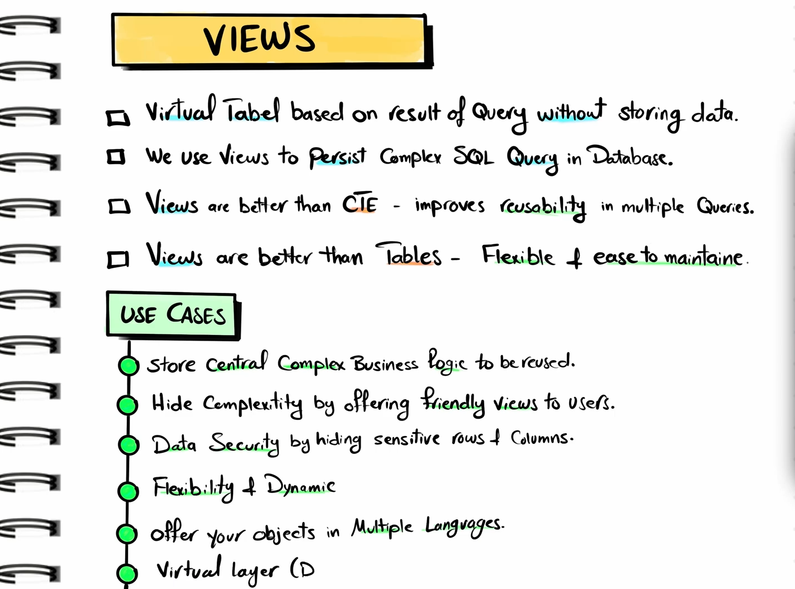

# Database Views - Complete Guide

## Table of Contents
1. [Basic Introduction](#basic-introduction)
2. [Definitions](#definitions)
3. [Why Views?](#why-views)
4. [Usage](#usage)
5. [Syntax](#syntax)
6. [Examples](#examples)
7. [Interview Preparation](#interview-preparation)

---

## Basic Introduction

A **View** in a database is a virtual table that is based on the result of an SQL statement. It contains rows and columns, just like a real table, but it doesn't store data physically. Instead, it dynamically generates data from one or more underlying tables when queried.

### Key Points:
- Views are virtual tables
- They don't store data physically
- Data is generated dynamically when queried
- Views can be based on one or more tables
- They provide a way to present data in a specific format

---

## Definitions

### 1. **View**
A view is a saved SQL query that can be treated as a virtual table. It's a logical representation of data from one or more tables.

### 2. **Base Table**
The underlying table(s) on which a view is created.

### 3. **Virtual Table**
A table that doesn't exist physically but is created dynamically based on a query.

### 4. **Materialized View**
A view that stores the result set physically (available in some database systems like Oracle, PostgreSQL).

### 5. **Updatable View**
A view through which you can insert, update, or delete data in the underlying base tables.

---

## Why Views?

### 1. **Security**
- Hide sensitive columns from users
- Provide restricted access to data
- Control what data users can see

### 2. **Simplification**
- Hide complex joins and calculations
- Provide a simplified interface to complex queries
- Make database easier to use for end users

### 3. **Data Abstraction**
- Present data in different formats
- Combine data from multiple tables
- Create logical groupings of data

### 4. **Consistency**
- Ensure consistent data presentation
- Standardize complex calculations
- Maintain uniform data access patterns

### 5. **Reusability**
- Reuse complex queries
- Avoid writing same complex joins repeatedly
- Create reusable business logic

### 6. **Backward Compatibility**
- Maintain old interfaces when table structure changes
- Provide stable API for applications

---

## Usage

### When to Use Views:

1. **Complex Joins**: When you frequently need to join multiple tables
2. **Data Security**: When you need to restrict access to certain columns
3. **Data Aggregation**: When you need calculated fields or summaries
4. **Legacy Support**: When maintaining compatibility with old applications
5. **Reporting**: When creating standardized reports
6. **Data Formatting**: When presenting data in specific formats

### When NOT to Use Views:

1. **Performance Critical Operations**: Views can add overhead
2. **Frequently Updated Data**: If base tables change frequently
3. **Simple Single Table Queries**: No real benefit over direct table access
4. **Complex Nested Views**: Can lead to performance issues

---

## Syntax

### Creating a View

```sql
CREATE VIEW view_name AS
SELECT column1, column2, ...
FROM table_name
WHERE condition;
```

### Creating or Replacing a View

```sql
CREATE OR REPLACE VIEW view_name AS
SELECT column1, column2, ...
FROM table_name
WHERE condition;
```

### Dropping a View

```sql
DROP VIEW view_name;
```

### Altering a View

```sql
ALTER VIEW view_name AS
SELECT column1, column2, ...
FROM table_name
WHERE new_condition;
```

### Querying a View

```sql
SELECT * FROM view_name;
SELECT column1, column2 FROM view_name WHERE condition;
```

---

## Examples

### Example 1: Simple View

**Base Tables:**
```sql
-- Employees table
CREATE TABLE employees (
    emp_id INT PRIMARY KEY,
    emp_name VARCHAR(100),
    department VARCHAR(50),
    salary DECIMAL(10,2),
    hire_date DATE
);

-- Create a view for active employees
CREATE VIEW active_employees AS
SELECT emp_id, emp_name, department
FROM employees
WHERE hire_date >= '2020-01-01';
```

### Example 2: View with Joins

```sql
-- Orders and Customers tables
CREATE TABLE customers (
    customer_id INT PRIMARY KEY,
    customer_name VARCHAR(100),
    city VARCHAR(50)
);

CREATE TABLE orders (
    order_id INT PRIMARY KEY,
    customer_id INT,
    order_date DATE,
    total_amount DECIMAL(10,2)
);

-- Create a view joining customers and orders
CREATE VIEW customer_orders AS
SELECT 
    c.customer_name,
    c.city,
    o.order_id,
    o.order_date,
    o.total_amount
FROM customers c
JOIN orders o ON c.customer_id = o.customer_id;
```

### Example 3: Aggregate View

```sql
-- Create a view with aggregated data
CREATE VIEW department_summary AS
SELECT 
    department,
    COUNT(*) as employee_count,
    AVG(salary) as avg_salary,
    MAX(salary) as max_salary,
    MIN(salary) as min_salary
FROM employees
GROUP BY department;
```

### Example 4: Complex View with Calculations

```sql
-- Create a view with calculated fields
CREATE VIEW employee_details AS
SELECT 
    emp_name,
    department,
    salary,
    salary * 12 as annual_salary,
    CASE 
        WHEN salary > 50000 THEN 'High'
        WHEN salary > 30000 THEN 'Medium'
        ELSE 'Low'
    END as salary_grade,
    DATEDIFF(CURDATE(), hire_date) as days_employed
FROM employees;
```

### Example 5: Security View

```sql
-- Create a view that hides sensitive information
CREATE VIEW public_employee_info AS
SELECT 
    emp_name,
    department,
    hire_date,
    CASE 
        WHEN salary > 40000 THEN 'Above Average'
        ELSE 'Average or Below'
    END as salary_range
FROM employees;
-- Salary details are hidden, only salary range is shown
```

### Example 6: Updatable View

```sql
-- Create an updatable view
CREATE VIEW department_employees AS
SELECT emp_id, emp_name, department, salary
FROM employees
WHERE department = 'IT';

-- You can update through this view
UPDATE department_employees 
SET salary = salary * 1.1 
WHERE emp_id = 101;
```

---

## Interview Preparation

### Common Interview Questions and Answers

#### Q1: What is a View in a database?
**Answer:** A view is a virtual table based on the result of an SQL statement. It contains rows and columns like a real table but doesn't store data physically. The data is generated dynamically from underlying tables when the view is queried.

#### Q2: What are the advantages of using Views?
**Answer:**
- **Security**: Hide sensitive data and provide controlled access
- **Simplicity**: Simplify complex queries and joins
- **Reusability**: Reuse complex logic across multiple queries
- **Data Abstraction**: Present data in different formats
- **Consistency**: Ensure uniform data presentation

#### Q3: What are the disadvantages of Views?
**Answer:**
- **Performance**: Can add overhead, especially for complex views
- **Limited Updates**: Not all views are updatable
- **Dependency**: Changes in base tables can break views
- **Debugging**: Can make debugging more complex

#### Q4: Difference between View and Table?
**Answer:**
| Aspect | Table | View |
|--------|-------|------|
| Storage | Physical storage | Virtual, no physical storage |
| Data | Stores actual data | Shows data from base tables |
| Performance | Faster access | Can be slower due to dynamic generation |
| Updates | Direct updates allowed | Limited update capabilities |
| Space | Takes disk space | No additional disk space |

#### Q5: What is a Materialized View?
**Answer:** A materialized view is a view that stores the result set physically in the database. Unlike regular views, materialized views contain actual data and can be refreshed periodically to sync with base tables.

#### Q6: Can you update data through a View?
**Answer:** Yes, but with conditions:
- View must be based on a single table
- View must include the primary key of the base table
- View cannot contain aggregate functions, DISTINCT, GROUP BY, or subqueries
- All NOT NULL columns must be included

#### Q7: What happens if you drop a table that has views dependent on it?
**Answer:** The views will become invalid and will throw errors when queried. Most databases don't automatically drop dependent views when a table is dropped.

#### Q8: How do you find all views in a database?
**Answer:**
```sql
-- MySQL
SHOW FULL TABLES WHERE Table_type = 'VIEW';

-- PostgreSQL
SELECT table_name FROM information_schema.views 
WHERE table_schema = 'your_schema';

-- SQL Server
SELECT name FROM sys.views;
```

#### Q9: What is the difference between a View and a Stored Procedure?
**Answer:**
| View | Stored Procedure |
|------|------------------|
| Returns a result set | Can perform multiple operations |
| Cannot take parameters | Can accept parameters |
| Can be used in SELECT statements | Called using EXEC/CALL |
| Read-only operations mainly | Can perform INSERT, UPDATE, DELETE |

#### Q10: Can a View be created on another View?
**Answer:** Yes, you can create views on other views (nested views). However, this should be done carefully as it can impact performance and make debugging difficult.

### Practice Scenarios

#### Scenario 1: Design Views for E-commerce
Create views for an e-commerce database to:
- Show customer order history
- Display product sales summary
- Create a dashboard view for admin

#### Scenario 2: Security Implementation
Design views to:
- Hide employee salary details from HR assistants
- Show only department-specific data to department managers
- Provide read-only access to sensitive financial data

#### Scenario 3: Performance Optimization
Analyze when to use:
- Regular views vs. materialized views
- Views vs. temporary tables
- Direct queries vs. view queries

### Key Points for Interviews

1. **Always mention security and simplification as primary benefits**
2. **Understand the difference between views and materialized views**
3. **Know the limitations of updatable views**
4. **Be aware of performance implications**
5. **Understand view dependencies and their management**
6. **Know how to troubleshoot view-related issues**

---

## Best Practices

1. **Naming Convention**: Use clear, descriptive names for views
2. **Documentation**: Document the purpose and logic of complex views
3. **Performance**: Monitor view performance and optimize when necessary
4. **Dependencies**: Keep track of view dependencies
5. **Security**: Use views to implement row-level and column-level security
6. **Maintenance**: Regularly review and update views as business requirements change

---

## CTE vs Views - Clear Explanation

### 🔷 What is a CTE (Common Table Expression)?
A CTE is a temporary, named result set that you can use within a SELECT, INSERT, UPDATE, or DELETE query. It helps make complex queries more readable and modular.

#### 🔹 CTE Syntax:
```sql
WITH cte_name AS (
    SELECT ...
)
SELECT * FROM cte_name;
```
You can even chain or nest multiple CTEs.

#### ✅ Use Cases for CTEs:
- Breaking down complex queries into smaller parts
- Recursion (e.g., hierarchical data like org charts)
- Reusing logic within a single query
- Improving readability

### 🔶 What is a View?
A view is a stored query in the database that acts like a virtual table. It's defined once and can be used many times like a regular table.

#### 🔹 View Syntax:
```sql
CREATE VIEW view_name AS
SELECT ...;
```
You query it like:
```sql
SELECT * FROM view_name;
```

#### ✅ Use Cases for Views:
- Reuse of common query logic across multiple queries
- Abstracting complex joins/filters for end users
- Security (e.g., showing only specific columns to users)
- Creating consistent reporting layers

### 🔄 CTE vs View — Key Differences

| Feature | CTE | View |
|---------|-----|------|
| **Lifetime** | Temporary (for one query only) | Persistent (stored in DB) |
| **Use Case** | Simplify one-off complex queries | Reuse query logic frequently |
| **Stored in DB** | ❌ No | ✅ Yes |
| **Recursion** | ✅ Supported | ❌ Not supported in most systems |
| **Performance** | Generally similar, depends on DB | Generally similar, depends on DB |
| **Updatable** | ❌ Not directly | ✅ Sometimes, if simple enough |

### 🧠 When to Use What?

| Scenario | Use |
|----------|-----|
| One-time query simplification | ✅ CTE |
| Query involves recursion | ✅ CTE |
| Reusable business logic / security abstraction | ✅ View |
| Frequently used reporting logic | ✅ View |
| Need a logical table without storing data | ✅ View |

### 🎓 Practical Example

**Scenario:** You have an `orders` table and want to find the top 2 customers by total spending.

**Sample Data:**
```sql
orders table:
order_id | customer_id | total_amount
1        | 101         | 500
2        | 102         | 700
3        | 101         | 300
4        | 103         | 400
5        | 102         | 600
```

#### ✅ Using a CTE:
```sql
WITH customer_totals AS (
    SELECT customer_id, SUM(total_amount) AS total_spent
    FROM orders
    GROUP BY customer_id
)
SELECT customer_id, total_spent
FROM customer_totals
ORDER BY total_spent DESC
LIMIT 2;
```

**🔹 Explanation:**
- The CTE `customer_totals` groups orders by customer_id and calculates total_spent
- Then we use this temporary result in the main query to get the top 2
- 🧠 The CTE only exists for this one query and disappears after it's executed

#### ✅ Using a View:
First, create a view:
```sql
CREATE VIEW customer_totals AS
SELECT customer_id, SUM(total_amount) AS total_spent
FROM orders
GROUP BY customer_id;
```

Now you can reuse it:
```sql
SELECT customer_id, total_spent
FROM customer_totals
ORDER BY total_spent DESC
LIMIT 2;
```

**🔹 Explanation:**
- `customer_totals` is a stored query (view)
- You can use this view in multiple queries—very useful if this logic is needed often

### 🔁 Summary Comparison

| Feature | CTE Example | View Example |
|---------|-------------|--------------|
| **Reusability** | ❌ One-time use in query | ✅ Can use in multiple queries |
| **Recursion** | ✅ Yes (optional) | ❌ Not suitable for recursion |
| **Storage** | ❌ Not stored in DB | ✅ Stored as a virtual table in DB |
| **Flexibility** | ✅ Good for complex and layered queries | ✅ Good for abstraction and security |

### 💡 Key Takeaways:
- **Use CTE** when you need temporary, one-time logic or recursion
- **Use Views** when you need reusable, persistent logic or security abstraction
- Both help organize complex queries but serve different purposes
<br><br>
# Conclusion
